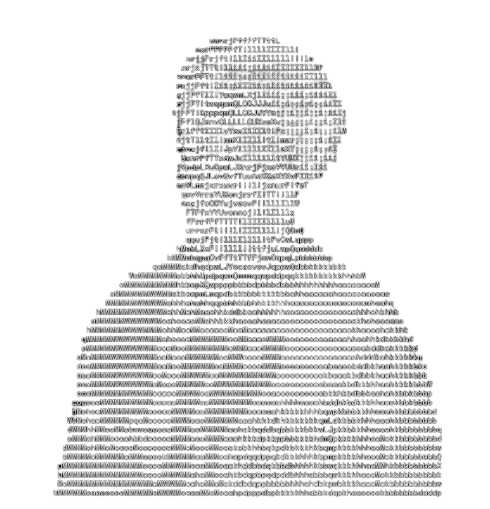
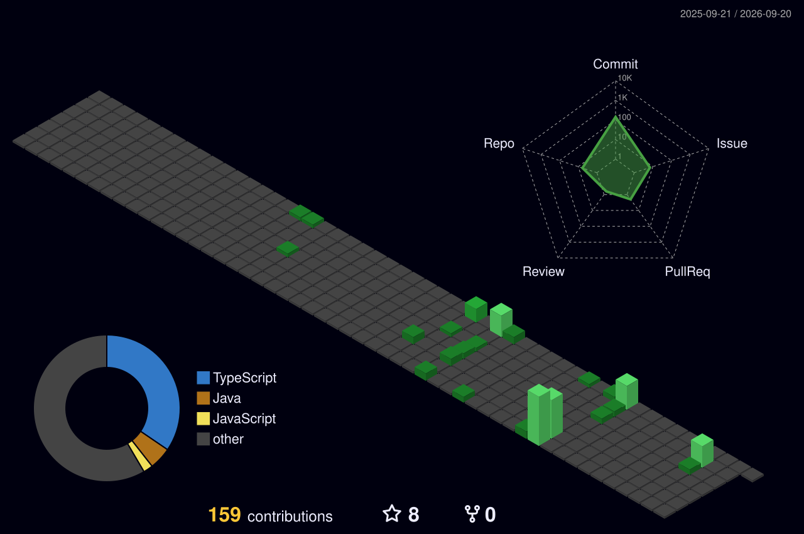

<p align="center">
  
</p>

<table width="100%">
<tr>
<td width="35%" align="left" valign="top">



</td>

<td width="65%" align="right" valign="middle">

<p align="right">
  <picture>
    <source
      media="(prefers-color-scheme: dark)"
      srcset="https://readme-typing-svg.demolab.com?font=JetBrains+Mono&weight=700&size=28&duration=3000&pause=1000&color=FFFFFF&background=0D111700&center=false&width=650&height=80&lines=Backend+Developer;Competitive+Programmer;Building+Scalable+Systems;Spring+Boot+%7C+Java+%7C+Microservices"
    />
    <source
      media="(prefers-color-scheme: light)"
      srcset="https://readme-typing-svg.demolab.com?font=JetBrains+Mono&weight=700&size=28&duration=3000&pause=1000&color=000000&background=FFFFFF00&center=false&width=650&height=80&lines=Backend+Developer;Competitive+Programmer;Building+Scalable+Systems;Spring+Boot+%7C+Java+%7C+Microservices"
    />
    
  </picture>
</p>

</td>
</tr>
</table>


<table>
<tr>

<td width="50%">
  


</td>

<td width="50%" valign="top">

# 💻 I Program Every Day

```cpp
while (alive) {
    solve();
    learn();
    improve();
}
```

### 🌐 Competitive Programming Profiles

<p>
  <a href="https://leetcode.com/u/ekamsinghahuja123/">
    
  </a>
  <br><br>
  <a href="https://codeforces.com/profile/makeinverse">
    
  </a>
  <br><br>
  <a href="https://www.codechef.com/users/ekam12345679">
    
  </a>
</p>

</td>

</tr>
</table>

<p align="center">
  
</p>

<table>
<tr>

<td width="50%" valign="top">

<h3>💻 Programming Languages</h3>

<p>

</p>

<h3>🚀 Frameworks</h3>

<p>

</p>

<p>


</p>

<h3>🔧 Build & Development</h3>

<p>

</p>

<p>

</p>

</td>

<td width="50%" valign="top">

<h3>☁️ DevOps & Infrastructure</h3>

<p>

</p>

<h3>🗄️ Databases</h3>

<p>

</p>

<h3>📨 Messaging & Communication</h3>

<p>

</p>

<p>


</p>

<h3>📈 Monitoring</h3>

<p>

</p>

</td>

</tr>
</table>

<p align="center">
  
</p>

<p align="center">
  
</p>
<div align="center">
  
</div>

