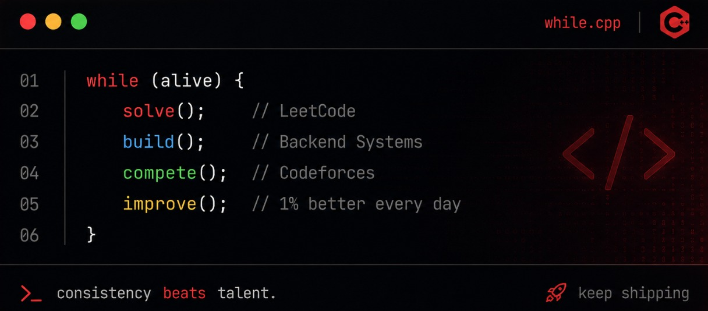

  

<table width="100%">
<tr>
<td width="50%" align="left" valign="top">

</td>

<td width="65%" align="right" valign="middle">

  <picture>
    <source
      media="(prefers-color-scheme: dark)"
      srcset="https://readme-typing-svg.demolab.com?font=JetBrains+Mono&weight=700&size=28&duration=3000&pause=1000&color=FFFFFF&background=0D111700&center=false&width=650&height=80&lines=Backend+Developer;Competitive+Programmer;Building+Scalable+Systems;Spring+Boot+%7C+Java+%7C+Microservices"
    />
    <source
      media="(prefers-color-scheme: light)"
      srcset="https://readme-typing-svg.demolab.com?font=JetBrains+Mono&weight=700&size=28&duration=3000&pause=1000&color=000000&background=FFFFFF00&center=false&width=650&height=80&lines=Backend+Developer;Competitive+Programmer;Building+Scalable+Systems;Spring+Boot+%7C+Java+%7C+Microservices"
    />
    
  </picture>

</td>
</tr>
</table>

<table>
<tr>

<td width="50%">
<picture>
  <source media="(prefers-color-scheme: dark)" srcset="https://cp-insights-three.vercel.app/api/profile?handle=makeinverse&theme=dark">
  <source media="(prefers-color-scheme: light)" srcset="https://cp-insights-three.vercel.app/api/profile?handle=makeinverse&theme=light">
  
</picture>

</td>

<td width="50%" valign="top">

<h2>
  
  
   Programming Is My Love ❤️
  
</h2>

  

<h3 align="center">Competitive Programming Profiles</h3>

  
  &nbsp;&nbsp;&nbsp;&nbsp;&nbsp;&nbsp;

  
  &nbsp;&nbsp;&nbsp;&nbsp;&nbsp;&nbsp;

  

  <strong>LeetCode</strong>
  &nbsp;&nbsp;&nbsp;&nbsp;&nbsp;&nbsp;&nbsp;&nbsp;&nbsp;
  <strong>Codeforces</strong>
  &nbsp;&nbsp;&nbsp;&nbsp;&nbsp;&nbsp;&nbsp;&nbsp;&nbsp;
  <strong>CodeChef</strong>

</td>

</tr>
</table>

  

<table width="400">
<tr>

<td width="50%" valign="top">

<h2>

&nbsp;Programming Languages
</h2>

 

<h2>

&nbsp;Frameworks
</h2>

 

 

<h2>

&nbsp;Build & Development
</h2>

 

</td>

<td width="50%" valign="top">

<h2>

&nbsp;DevOps & Infrastructure
</h2>

 

<h2>
&nbsp;Databases</h2>

 

<h2>

&nbsp;Communication
</h2>

 

 

<h2> 

&nbsp;Monitoring
</h2>

</td>

</tr>
</table>

  

  <picture>
    <source
      media="(prefers-color-scheme: dark)"
      srcset="./profile-3d-contrib/profile-night-green.svg"
    />
    <source
      media="(prefers-color-scheme: light)"
      srcset="./profile-3d-contrib/profile-green-animate.svg"
    />
    
  </picture>

  

