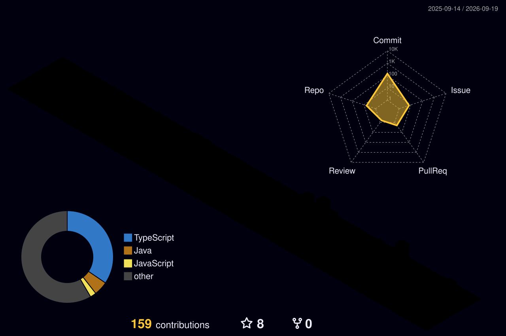

  

<table width="100%">
<tr>
<td width="35%" align="left" valign="top">

</td>

<td width="65%" align="right" valign="middle">

  <picture>
    <source
      media="(prefers-color-scheme: dark)"
      srcset="https://readme-typing-svg.demolab.com?font=JetBrains+Mono&weight=700&size=28&duration=3000&pause=1000&color=FFFFFF&background=0D111700&center=false&width=650&height=80&lines=Backend+Developer;Competitive+Programmer;Building+Scalable+Systems;Spring+Boot+%7C+Java+%7C+Microservices"
    />
    <source
      media="(prefers-color-scheme: light)"
      srcset="https://readme-typing-svg.demolab.com?font=JetBrains+Mono&weight=700&size=28&duration=3000&pause=1000&color=000000&background=FFFFFF00&center=false&width=650&height=80&lines=Backend+Developer;Competitive+Programmer;Building+Scalable+Systems;Spring+Boot+%7C+Java+%7C+Microservices"
    />
    
  </picture>

</td>
</tr>
</table>

  

## 💻 Programming Languages

  

## 🚀 Frameworks & Libraries

  

  
  
  

## ☁️ DevOps & Cloud

  

## 🗄️ Databases & Messaging

  

  
  
  
  

## 📊 Monitoring & Tools

  

  

  

  

  

